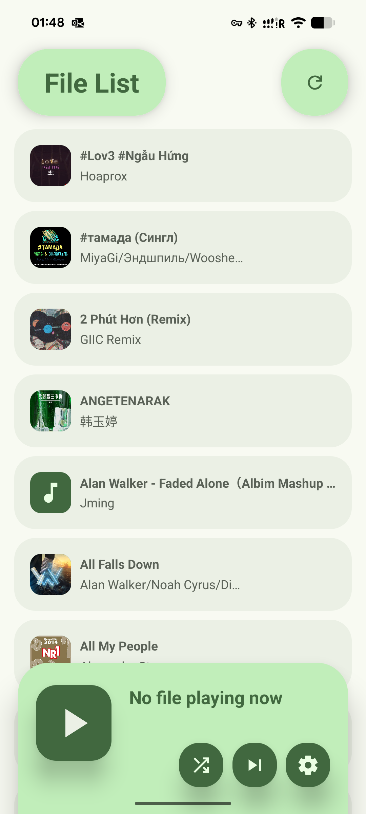
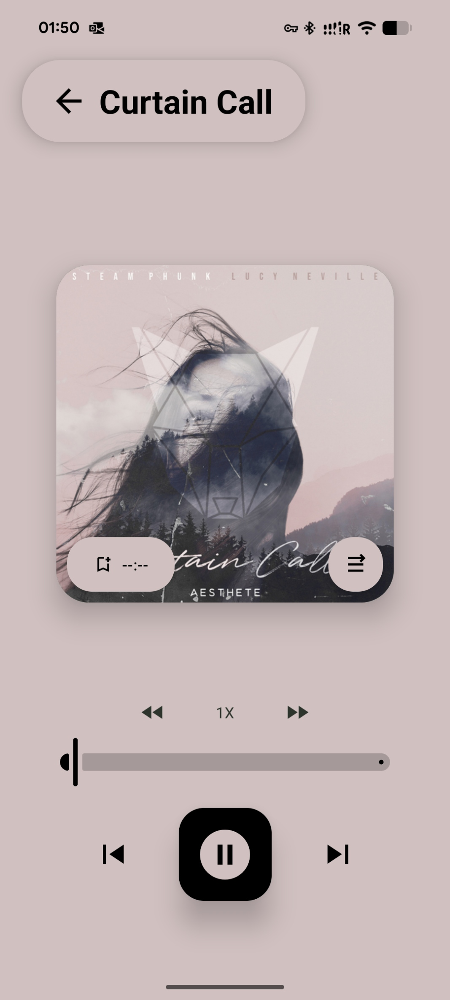
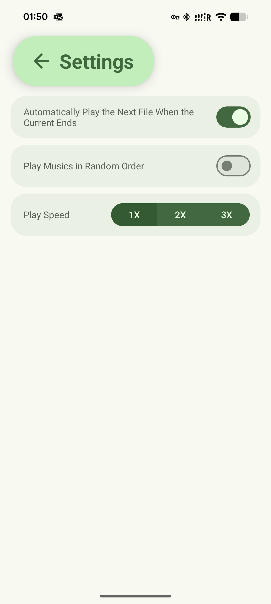

This is built from a college coursework, NO RELEASE WILL BE PUBLISHED.
# AudioPlayer, a Simple Local Music File Player on Android
# AudioPlayer，一个简单的 Android 本地音频播放器
This project is developed using the ExoPlayer media player and employs the Material Design 3 aesthetic. The application prioritises a lightweight design, supporting fundamental playback and bookmarking functionality. The player features an immersive playback interface, complemented by album artwork to deliver a comfortable listening experience for users.

本项目基于 ExoPlayer 播放器开发，采用 Material Design 3 设计风格。应用主打轻量化设计，支持基本的播放与书签记录功能。播放器支持沉浸式播放界面，搭配专辑图片给予用户舒适的播放体验。

<table>
  <tr>
    <td width="30%"></td>
    <td width="5%"></td>
    <td width="30%"></td>
    <td width="5%"></td>
    <td width="30%"></td>
  </tr>
</table>
